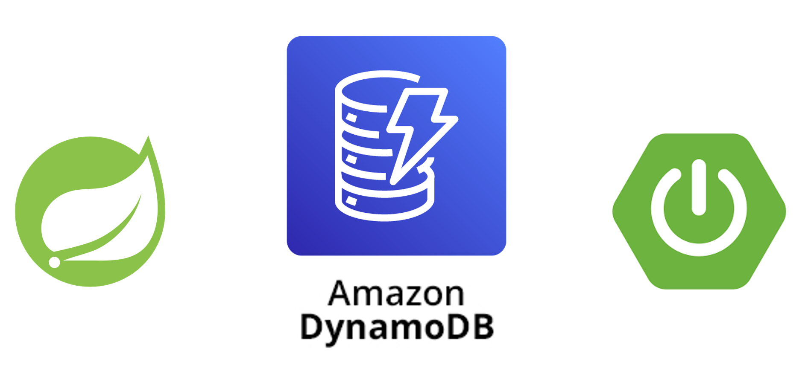
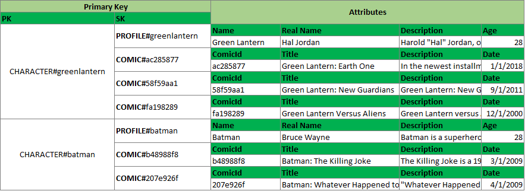

# Single Table Design + Spring Boot

<p align="center">
    
    <br />
    <br />
    <a href="https://github.com/jjeanjacques10/spring-dynamodb-single-table-design/issues">Report Bug</a>
    ·
    <a href="https://github.com/jjeanjacques10/spring-dynamodb-single-table-design/issues">Request Feature</a>
</p>

<p align="center">
   <a href="https://www.linkedin.com/in/jjean-jacques10/">
      
   </a>
  

  <a href="https://github.com/jjeanjacques10/spring-dynamodb-single-table-design/commits/master">
    
  </a>
  
  
  <a href="https://github.com/jjeanjacques10/spring-dynamodb-single-table-design/stargazers">
    
  </a>
</p>

Demo project for Spring Boot + DynamoDB Single Table Design

## Tecnologies

- Java 17
- Spring Boot
- DynamoDb

**Libs**

- [AWS Java SDK Dynamodb](https://docs.aws.amazon.com/amazondynamodb/latest/developerguide/CodeSamples.Java.html)
- Dynamodb Enhanced

## Table

Access **tb_comics** in [./environment/dynamodb/tables.json](./environment/dynamodb/tables.json)



## Get Started

Create Table in DynamoDb simulator using Localstack.

``` bash
docker-compose up -d --build
```

- Access DynamoDb Admin: http://localhost:8001/

## Request Examples

- GET - http://localhost:8080/character
- GET - http://localhost:8080/character/profile/{nickname}
- GET - http://localhost:8080/comics
- GET - http://localhost:8080/comics/{nickname}

``` bash
curl --location --request GET 'http://localhost:8080/character/profile/greenlantern'
```

Postman Collection: [Comics.postman_collection.json](./files/Comics.postman_collection.json)

## Notes

- You can't use ``begin_with`` with PartitionKey, you can only use on the SortKey.
- Primary keys in DynamoDB can be either simple or composite.
    - Simple primary keys are consist of a partition key and no sort key.
    - Composite primary keys have both a partition key and a sort key.

## Article

- [[PT-BR] DynamoDB Single-Table Design com Spring Boot](https://jjeanjacques10.medium.com/dynamodb-single-table-design-com-spring-boot-4d4af58221b6)

## References

- [The What, Why, and When of Single-Table Design with DynamoDB](https://www.alexdebrie.com/posts/dynamodb-single-table/)
- [Amazon DynamoDB single-table design using DynamoDBMapper and Spring Boot](https://aws.amazon.com/blogs/database/amazon-dynamodb-single-table-design-using-dynamodbmapper-and-spring-boot/)
- [Single-table vs. multi-table design in Amazon DynamoDB](https://aws.amazon.com/blogs/database/single-table-vs-multi-table-design-in-amazon-dynamodb/)

---
Developed by [Jean Jacques Barros](https://github.com/jjeanjacques10)